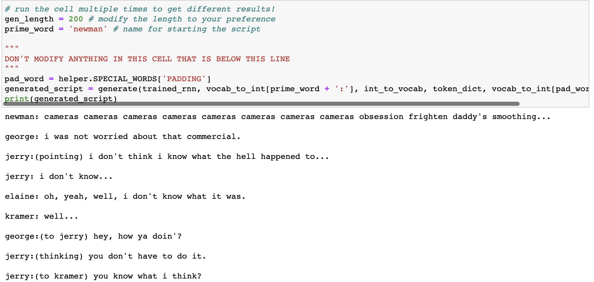
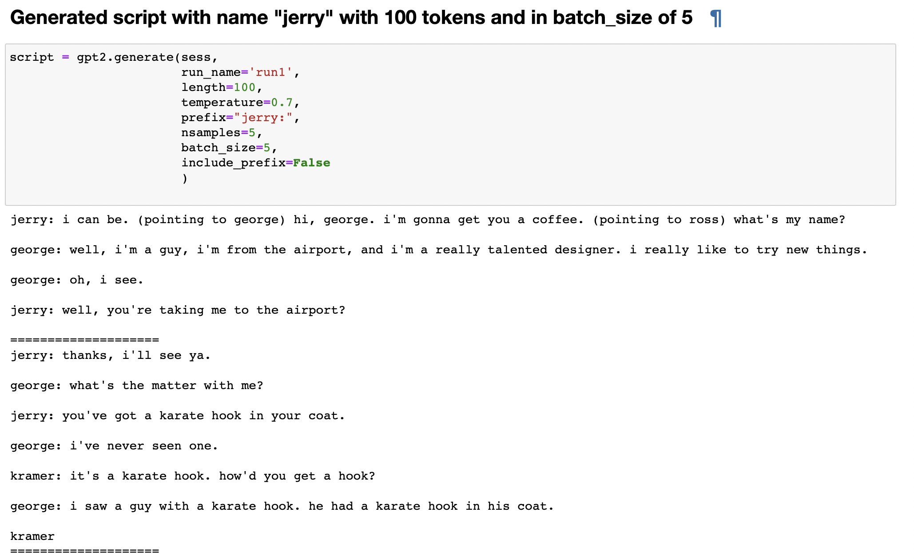

# Screenplay Generation using GPT-2 and LSTM
<image align="center" src="https://user-images.githubusercontent.com/43872050/196559217-707989b8-c368-4c85-932c-f2b5e377b6dd.png"/>

NLP-Project

## Team Members:
- Maryam Yahayabhai Merchant
- Siby Babu Panchakalayil

# Abstract
Screenplays contain semantically and structurally rich text as the average movie screenplay is thousands of words (tokens) long and contains long range dependencies of entity relations and contextual plot elements throughout. Large-scale pre-trained language models (like GPT-2) perform very well in open-domain text generation when the generated outputs are only ten to low hundreds of tokens long. This project aims to test how well current large transformer models perform at producing long, coherent texts for the task of movie screenplay generation. We compared the outputs of several different models such as LSTM and GPT2 for 10 epochs. This report investigates the performance of long short-term memory (LSTM) and Generative Pre-trained Transformer 2 (GPT-2) in natural language processing (NLP) tasks. Specifically, we conduct experiments text generation. For sentiment analysis, we use a dataset of movie reviews and compare the accuracy of LSTM and GPT-2 models. For text generation, we fine-tune the LSTM and GPT-2 model on a dataset of SeinFeld and evaluate the quality of the generated script using several metrics. Our experimental results show that GPT-2 outperforms LSTM on the text generation task in terms Bleu Score, Meteor and Loss. Overall, our findings demonstrate the strengths and weaknesses of LSTM and GPT-2 models in NLP tasks and provide insights for future research in this area.

# Loss 
As below we can see GPT-2 gave us less loss and better result than LSTM
1. LSTM Loss: Epoch:   10/10    Loss: 3.3531750526428223
2. GPT-2 loss: [100 | 13435.28] loss=2.41 avg=2.40

# Results
### LSTM Output:

### GPT-2 output:

